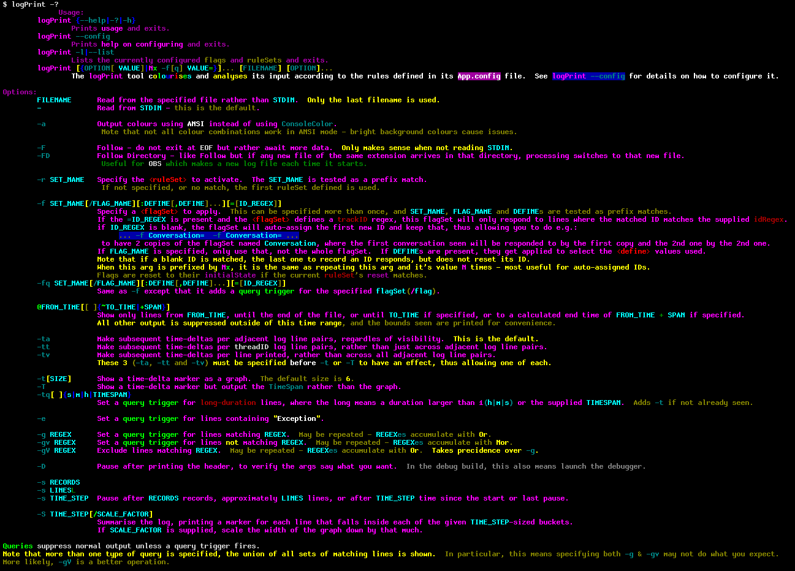
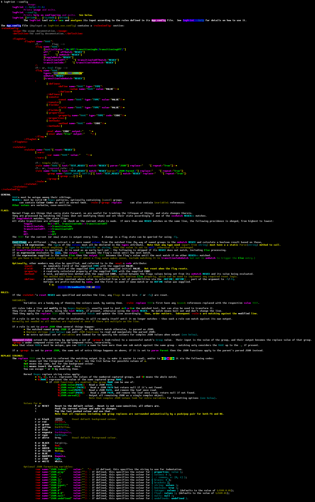

# LogPrint
## A commandline tool for reading and querying log files.

Run `logPrint -?` for usage.

It can be used to easily filter and query log files, and via config edits, flags can be specified that track events found in the logs, allowing easy tracking of current state, and queries against that.
It contains `grep`-like support, using .Net RegExes, and also has built in `tail -f` that works for the file or the directory (for things that roll logs, or make a new one every time the process starts) that takes care not to lock the files its watching.

