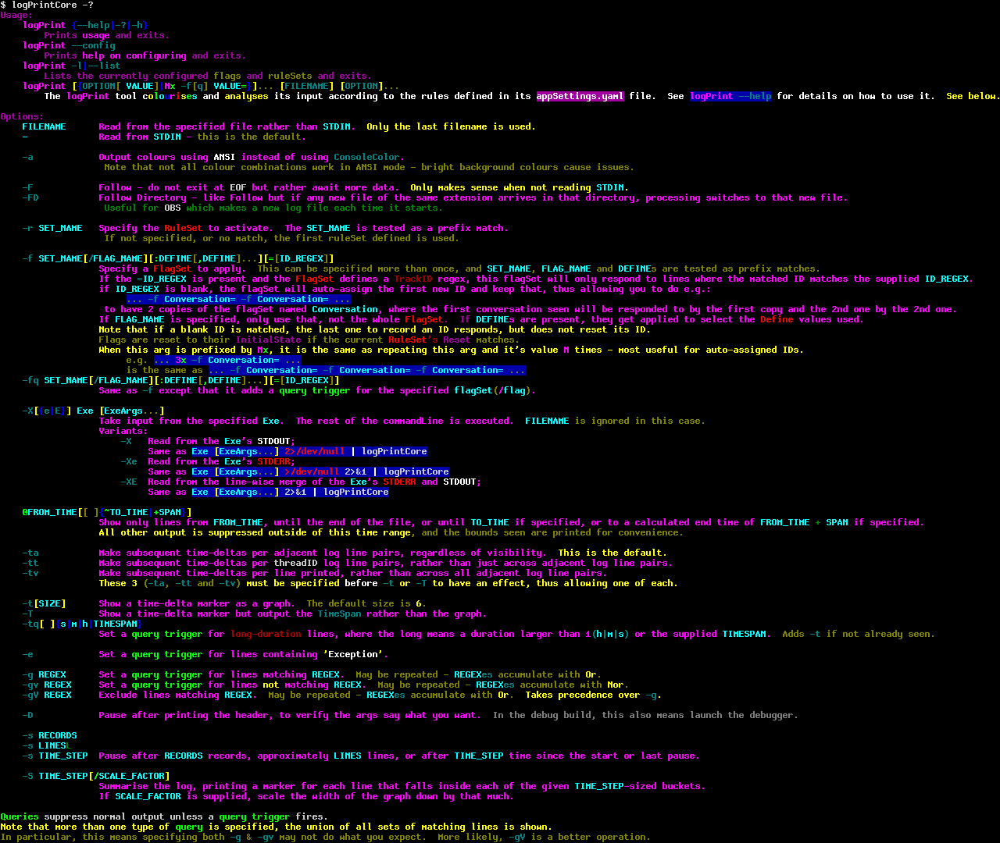
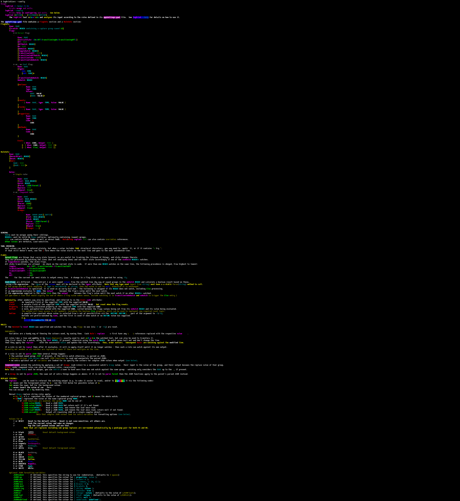

# LogPrintCore
## A commandline tool for reading and querying log files.
### Now .NetCore so it works for everyone `(c:`

Run `logPrintCore -?` for usage.

It can be used to easily filter and query log files, and via config edits, flags can be specified that track events found in the logs, allowing easy tracking of current state, and queries against that.
It contains `grep`-like support, using .Net RegExes, and also has built in `tail -f` that works for the file or the directory (for things that roll logs, or make a new one every time the process starts) that takes care not to lock the files its watching.






## Using when debugging

If you want to debug a .NetCore app/service in VisualStudio, follow these steps:

### Log to file and watch the directory

Where you configure your Serilog logger, add `Serilog.Sinks.File` package if not already present and add something like the following:
```
#if DEBUG
		loggerConfiguration.WriteTo.File(new CompactJsonFormatter(), "logs/log.txt", rollingInterval: RollingInterval.Day);
#endif
```

Then the project will echo the JSON-formatted loging visible on the console to the logs directory next to where it runs from.

Then it's a simple matter of opening a console there and running `logPrintCore -FD logs/oneOfTheLogFiles.log` and it'll output the file, and should any more content be appended, or if a new file arrives, it'll output that too.

One advantage of this method is that it makes using the various querying facilities of logPrint easy as you have the previous logs in a file.

### To Wrap VisualStudio Debug Output

If the above is not an option, the following also works:

1. Open the project(s) properties and go to the *Debug* tab.
2. **Optional:** Make a new _Profile_.
3. Change the _Launch_ option to **Executable**.
4. Change the _Executable_ path to that of where you built `logPrintCore.exe` to.
5. Change the _Application arguments_ to `-Xe dotnet "$(TargetDir)$(TargetFileName)"` followed by any original args.
6. Change the _Working directory_ to `$(ProjectDir)`.
7. Given you are now debugging `logPrintCore`, Under the *Debug>Options...* menu, in the **Symbols** section, make sure there is a pattern (or patterns) for the code you want to step through.
8. **Optional:** To debug startup code, add a magic arg that causes your process to `Thread.Sleep(10000);` or similar, and add that arg in step 5, so that you have time after starting Debugging to *Attach to Process*; logPrintCore will have printed the PID on child process startup (it'll be a `dotnet` process):
```
	public class Program
	{
		static int Main(string[] args)
		{
			if (args.Contains("-DEBUG")) {
				Console.WriteLine("[...");
				while (!System.Diagnostics.Debugger.IsAttached) {
					Thread.Sleep(100);
				}
				Console.WriteLine("...]");
			}
			...
```

```
//LATER: if .NetCore ever gives us a cross-platform way to SIGINT the child process, do that on ^C...
```
